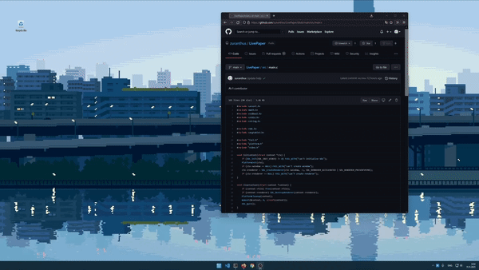

# LivePaper
 

LivePaper is a lightweight application that displays live wallpapers on Windows and Linux.
<br>Both gif and video files are supported. If FFmpeg can play the file, LivePaper can show it as your desktop background.



_Wallpaper art by [Toyoi Yuuta](https://twitter.com/1041uuu)_

## Installation
**Windows** - use the latest prebuilt binaries: [MSI installer](https://github.com/zuranthus/LivePaper/releases/download/latest/LivePaper-0.0.0-win64.msi) or [portable zip](https://github.com/zuranthus/LivePaper/releases/download/latest/LivePaper-0.0.0-win64.zip).

**Linux** - build locally from source. Instructions are [here](#build).

## Usage
### Windows
LivePaper will run in background, placing the icon in the tray. If it is the first run, the app will open a window where you can choose the file to be displayed as the wallpaper. LivePaper will remember this file and will start playing it the next time you run the app. You can change the wallpaper or quit the app via the tray icon.  


To run LivePaper at startup, follow [the guide](https://support.microsoft.com/en-us/windows/add-an-app-to-run-automatically-at-startup-in-windows-10-150da165-dcd9-7230-517b-cf3c295d89dd) from Microsoft (works for Windows 7+).

Note that if LivePaper quits due to error, the remembered wallpaper file will be cleared. The next time the app is started, you will need to choose the wallpaper file again.

### Linux
LivePaper is a console application on Linux.
```
Usage: live-paper [-h] [--fit-mode=<mode>] [--cache] <file>
Display a video or an animated file as desktop background.

  -h, --help   = display this help and exit
  --fit-mode=<mode>
               = controls the way the wallpaper is fit on screen
                 possible values: fit, fill, center
  --cache      = decode all frames at once and store them in memory
                 this option is available for short clips only (<=16 frames)
  <file>       = video or animation file to display

Examples: live-paper loop.mp4
          live-paper --fit-mode=fill --cache wallpaper.gif
```

Append `&` to run LivePaper background. Run `killall live-paper` to stop it.

## Build
### Windows
Visual Studio 2019 or later is recommended. CMake will download all dependencies during configuration when building with VS.

You can do everything from Visual Studio, if desired. Choose "Clone a repostiory..." from the startup menu to clone this repository. VS will configure the project using CMake. Then build as usual.

You can also build in terminal, similarly to the Linux instructions below. You need to install the requirements manually if using e.g. MinGW.

### Linux
Install the requirements
- cmake 3.14
- ffmpeg OR libavcodec-dev libavformat-dev libavutil-dev libswscale-dev libavdevice-dev for Ubuntu and the like
- sdl2

Example for Ubuntu 

```bash
$ sudo apt-get -yq install cmake libsdl2-dev libavcodec-dev libavformat-dev libavutil-dev libswscale-dev libavdevice-dev
```

For Arch
```bash
$ sudo pacman -S cmake sdl2 ffmpeg
```

Then clone the repository, configure and build with CMake.
```bash
$ git clone https://github.com/zuranthus/LivePaper.git && cd LivePaper
$ cmake -B build
$ cmake --build build
```
To test, run
```
$ ./build/live-paper assets/test.gif &
```

## Notice

Art by [Toyoi Yuuta](https://twitter.com/1041uuu) is used for test wallpapers.
